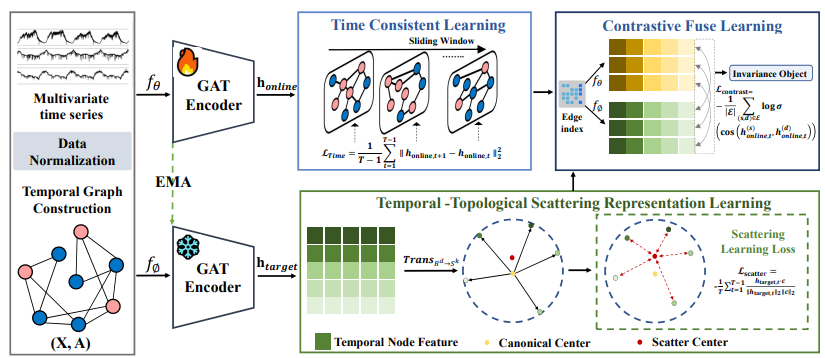
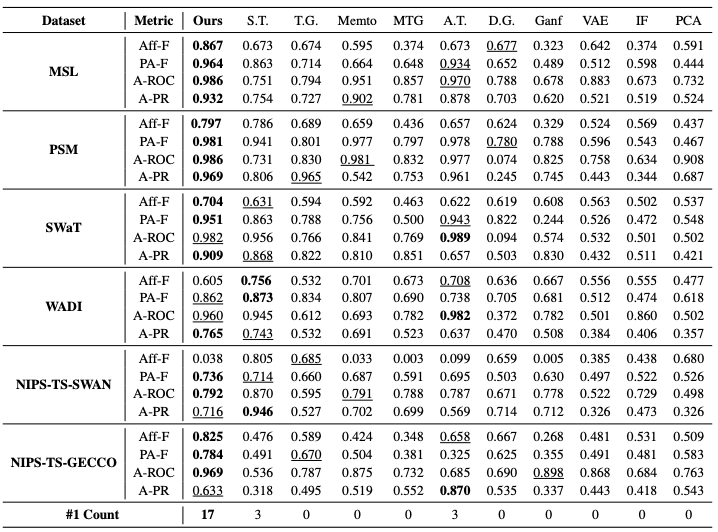
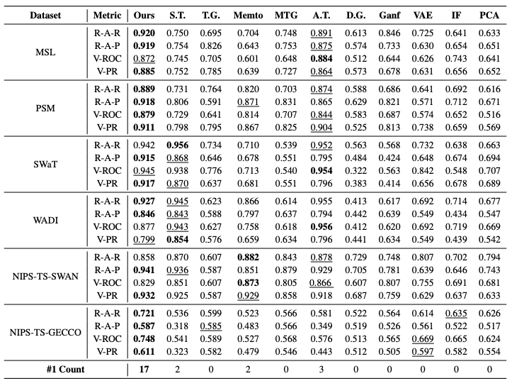
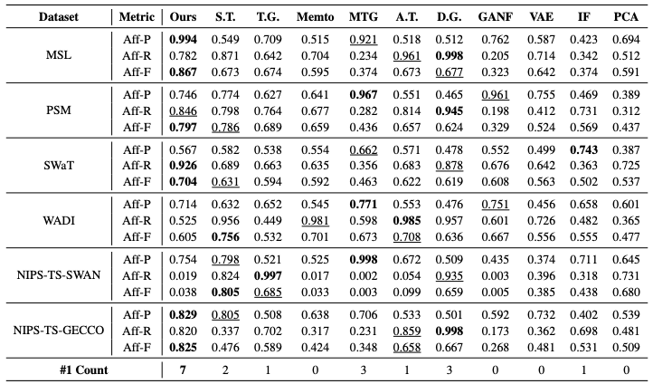
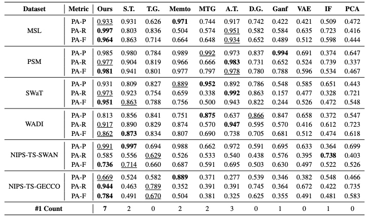

# ScatterAD: Temporal-Topological Scattering Mechanism for Time Series Anomaly Detection

ScatterAD leverages representation scattering as an inductive signal to jointly model temporal and topological patterns for effective multivariate time series anomaly detection.

## Key Features

1. **Dual Encoder Architecture**:
   - Topological Encoder: Captures graph-structured scattered features
   - Temporal Encoder: Constrains excessive scattering by minimizing mean squared error between adjacent time steps

2. **Contrastive Fusion Mechanism**:
   - Ensures learned temporal and topological representations are complementary
   - Enhances cross-view consistency by maximizing conditional mutual information between temporal and topological views
   - Strengthens the discriminative power of representations

3. **Theoretical Guarantees**:
   - Proves that maximizing conditional mutual information can enhance cross-view consistency
   - Contributes to learning more discriminative representations

## Model Architecture



## Project Structure

```
Code/
├── data_factory/     # Data loading and processing modules
├── model/           # Model definitions
│   └── ScatterAD.py # Core model implementation
├── metrics/         # Evaluation metrics
├── cpt/            # Model checkpoint directory
├── img/            # Image resources
├── scripts/        # Helper scripts
├── main.py         # Main program entry
├── solver.py       # Training and testing solver
└── requirements.txt # Project dependencies
```

## Getting Started

Download data. You can obtain all benchmarks from dcdetector:[Google Cloud](https://drive.google.com/drive/folders/1RaIJQ8esoWuhyphhmMaH-VCDh-WIluRR?usp=sharing).

### Requirements

- Python 3.8+
- PyTorch 1.11.0
- PyTorch Geometric 2.1.0
- Other dependencies listed in `requirements.txt`

### Installation

Install dependencies:
```bash
pip install -r requirements.txt
```

### Usage

#### Training a Model

```bash
python main.py --mode train \
    --dataset MSL \
    --data_path ../AnomalyDataset/MSL \
    --lr 0.0001 \
    --num_epochs 2 \
    --batch_size 128 \
    --win_size 110 \
    --input_c 55 \
    --output_c 55 \
    --d_model 512 \
    --e_layers 2
```

#### Testing a Model

```bash
python main.py --mode test \
    --dataset MSL \
    --data_path ../AnomalyDataset/MSL \
    --model_save_path cpt
```

#### Training and Testing All Models

```bash
bash ./scipts/all.sh
```

### Key Parameters

- `--mode`: Running mode, options: 'train', 'test', or 'all'
- `--dataset`: Dataset name
- `--data_path`: Dataset path
- `--lr`: Learning rate
- `--num_epochs`: Number of training epochs
- `--batch_size`: Batch size
- `--win_size`: Time window size
- `--input_c`: Input feature dimension
- `--output_c`: Output feature dimension
- `--d_model`: Model dimension
- `--e_layers`: Number of encoder layers
- `--gpu`: GPU device ID
- `--anormly_ratio`: Anomaly ratio threshold

## Evaluation Metrics

The model employs 12 comprehensive evaluation metrics:

### Label-based Metrics
1. **Affiliated-Precision (Aff-P)**
2. **Affiliated-Recall (Aff-R)**
3. **Affiliated-F1 (Aff-F)**
4. **Point-Adjusted-Precision (PA-P)**
5. **Point-Adjusted-Recall (PA-R)**
6. **Point-Adjusted-F1 (PA-F)**

### Score-based Metrics
7. **Area Under Precision-Recall Curve (AUC-PR)**
8. **Area Under ROC Curve (AUC-ROC)**
9. **Range Area Under Precision-Recall Curve (Range-AUC-PR, R-A-P)**
10. **Range Area Under ROC Curve (Range-AUC-ROC, R-A-R)**
11. **Volume Under the Surface-ROC (V-ROC)**
12. **Volume Under the Surface-PR (V-PR)**

## Main Results






## Logs

Training and testing logs will be saved in the `../logs/` directory.

## License

See the `LICENSE` file for details.
